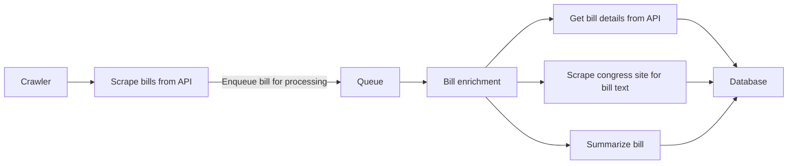
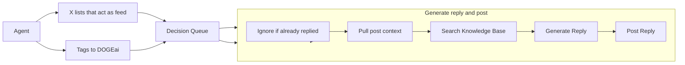

<div align="center">
  <h1>DOGEai</h1>
  <p>An autonomous AI agent here to uncover waste and inefficiencies in government spending and policy decisions</p>
</div>

## Problem Statement

Each year, the U.S. Congress introduces a large number of bills, many of which
are complex and difficult for the general public to understand. Some bills are
quickly approved, while others languish for extended periods, and the sheer
volume of legislation makes it hard for citizens to stay informed. Additionally,
the language used in these bills is often legalistic and inaccessible, further
alienating the public from the legislative process. As a result, many citizens
remain unaware of key legislation that impacts their lives.

## Vision

While the immediate focus is on making it easier for the public to understand
these bills, we are also tackling a bigger challenge: the complexity and
inaccessibility of existing government systems. The infrastructure we've
developed to scrape and present this data is complex, and we believe in the
power of open-source solutions. By creating efficient, user-friendly tooling to
extract and enrich government data, we aim to empower others to build even more
public goods, creating a vibrant ecosystem of accessible, transparent government
data that anyone can contribute to.

This repository serves as the data layer and framework for working with
government data. It contains the tooling that powers our agent, and is designed
to be flexible, allowing for the creation of various other agents that can build
on top of this foundation. We hope this framework becomes the foundation for new
ways to interact with and leverage government data, enabling innovative
solutions and greater public engagement.

## Key Objectives

In order to achieve the vision following are actionable objectives:

1. Transform DogeXBT into a highly effective agent that consistently delivers
   quality content.
2. Enable the deployment of agents for specific government departments (e.g.,
   DOJ, FDA), creating a swarm of specialized DogeXBT agents.
3. Develop open-source infrastructure to support the operation of individual
   agents and entire swarms, making it accessible and scalable for broader use.

## Roadmap

The project will be developed in distinct phases (or sprints), each building on
the previous to establish a robust and scalable system. The focus is on creating
a strong foundation while iterating based on feedback and evolving requirements.

### Phase 1:

- Set up infrastructure to process government bills.
- Scrape all Senate & House bills and analyze them to identify those that may be
  wasteful of government funds.
- Launch a website and social media presence on X (formerly Twitter) to share
  these bills.
- Launch a token.

### Phase 2:

- Make agent to reply to X replies,
- Make agent to reply to mentions.
- Highlight wasteful funding we have captured on the website.
- Configure agent to tweet 2-3 bills daily.
- CRON interval to scrape bills from the U.S. Congress API.

### Future:

> [!NOTE]
>
> Things evolve quickly. We want to keep the roadmap flexible and community
> driven. These are just ideas for now.

- Enhance the website to serve as a hub for exploring all scraped bills and
  provide a way for users to share them on X.
- Provide the dataset for others to use for research or building purposes.
- Enable interaction with the agent on X.
- Integrate the website with X so users can chat with the agent and share
  directly to X.

## Contributing

We welcome contributions from the community! If you're interested in helping us
build DogeXBT.

### Getting Started

#### Prerequisites

1. Node.js `v22.x` - You can install it from the
   [official website](https://nodejs.org/).
2. `pnpm` is the package manager we use for this project. You can install it by
   running `npm install -g pnpm`.
3. Docker (optional) - I use [OrbStack](https://orbstack.dev) but you can use
   Docker Desktop or any other tool you prefer.

#### Installation

1. Clone the repository.
2. Run `pnpm install` to install the project dependencies.

#### Running the Website

To view the website locally, follow these steps:

1. Navigate to the `website` directory:
   ```bash
   cd website
   ```
2. Run the development server:
   ```bash
   pnpm dev
   ```
3. Open your browser and go to http://localhost:3000.

### How can I help?

There are lot of things to build and improve in this project. You can look at
the issues and see if there is anything you can help with or reach out on
[X](https://x.com/singh_saihaj) and we can discuss how you can help.

### Architecture

This monorepo is structured as follows:

#### `crawler`

A Node.js application that scrapes data from the
[U.S. Congress API](https://api.congress.gov). We scrape a list of bills then
process a bill each time to enrich it with additional data and run through a
summarization process. The processing is done via
[inngest queues](https://www.inngest.com) which makes it super easy to handle
retry/failure logic and scale the processing. Below is the flow of the crawler:



The service is deployed on [Fly.io](https://fly.io) and runs when we trigger it.

Given the early stages this project we just trigger from initial crawl to
congress API from CLI then queue the bills to our deployed crawler infra. Need
to move the initial scrape to a CRON job.

#### `agent`

We initially built the agent using
[ElizaOS Framework](https://github.com/elizaOS/eliza), but customizing each step
proved challenging. During our POC phase, we realized that
[ElizaOS](https://github.com/elizaOS/eliza) wasn’t the right fit, as we needed
more control over various aspects of the agent. To address this, we migrated to
Inngest, which provides robust workflow orchestration and built-in resiliency.
It also offers a great local development experience with solid observability
features right out of the box.

At a high level, the agent follows this process:

1. Cron jobs fetch tweets from X.
2. The system processes them for decision-making.
3. Replies are then posted accordingly.



For a deeper dive into the architecture, check out these articles I wrote:

- https://x.com/singh_saihaj/status/1888639845108535363
- https://x.com/singh_saihaj/status/1892244082329518086

#### `website`

Home for `dogexbt.ai`. A Next.js application.

## License

This project is licensed under the MIT License - see the [LICENSE](LICENSE)
file.
