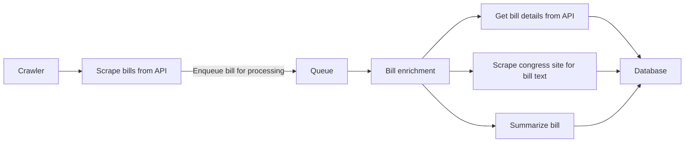

  <h1>DogeXBT</h1>
  <h5>An autonomous AI agent here to uncover waste and inefficiencies in government spending and policy decisions 🔍 💸 🤖</h5>

## Problem Statement

Each year, the U.S. Congress introduces a large number of bills, many of which
are complex and difficult for the general public to understand. Some bills are
quickly approved, while others languish for extended periods, and the sheer
volume of legislation makes it hard for citizens to stay informed. Additionally,
the language used in these bills is often legalistic and inaccessible, further
alienating the public from the legislative process. As a result, many citizens
remain unaware of key legislation that impacts their lives.

## Vision

We aim to demystify U.S. Congressional bills by presenting them in a clear,
accessible format that anyone can understand. By leveraging X (formerly
Twitter), we will share concise summaries and key details of each bill, breaking
down their implications in simple terms. Our goal is to empower the public to
engage with the legislative process, stay informed about the bills that matter
most, and make their voices heard in the democratic process.

## Contributing

We welcome contributions from the community! If you're interested in helping us
build DogeXBT.

### Getting Started

#### Prerequisites

1. Node.js `v22.x` - You can install it from the
   [official website](https://nodejs.org/).
2. `pnpm` is the package manager we use for this project. You can install it by
   running `npm install -g pnpm`.
3. Docker (optional) - I use [OrbStack](https://orbstack.dev) but you can use
   Docker Desktop or any other tool you prefer.

#### Installation

1. Clone the repository.
2. Run `pnpm install` to install the project dependencies.

### Architecture

This monorepo is structured as follows:

#### `crawler`

A Node.js application that scrapes data from the
[U.S. Congress API](https://api.congress.gov). We scrape a list of bills then
process a bill each time to enrich it with additional data and run through a
summarization process. The processing is done via
[inngest queues](https://www.inngest.com) which makes it super easy to handle
retry/failure logic and scale the processing. Below is the flow of the crawler:

The service is deployed on [Fly.io](https://fly.io) and runs when we trigger it.

Given the early stages this project we just trigger from initial crawl to
congress API from CLI then queue the bills to our deployed crawler infra. Need
to move the initial scrape to a CRON job.

#### `agent`

This is based on [Eliza framework](https://github.com/elizaOS/eliza). Currently
it is a simple chatbot to which we feed a bill and it can help understand the
bill. Given the early stage of the project and we are still tweaking our agent.
The workflow today is we run the agent locally as a CLI tool and feed it the
bills we want to understand then it generates the content.

#### `website`

Home for `dogexbt.ai`. A Next.js application.

### How can I help?

There are lot of things to build and improve in this project. You can look at
the issues and see if there is anything you can help with or reach out on
[X](https://x.com/singh_saihaj) and we can discuss how you can help.

## License

This project is licensed under the MIT License - see the [LICENSE](LICENSE)
file.
